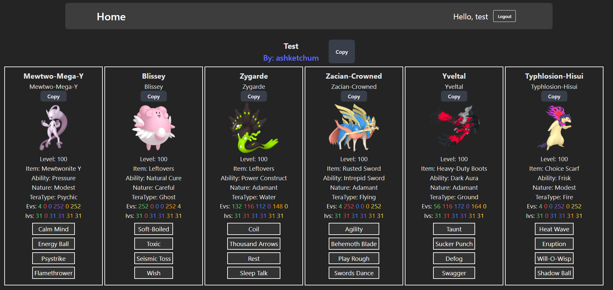

# Pokemon Showdown Teams
**Tech used:** Javascript, HTML, CSS, React.js, Express.js, MongoDB

## Overview
Pokemon Showdown Teams is a web app that lets people upload, explore, and copy teams in the
[Pokemon Showdown Team Export Format.](https://github.com/smogon/pokemon-showdown/blob/master/sim/TEAMS.md#export-format)
 
Users can:
- Upload and share their own teams
- Lookup teams of other users
- Copy other teams to use for themselves
 

Sprites and team verification from the [Pokemon Showdown Library](https://github.com/smogon/pokemon-showdown/) from Smogon on github.

Example team view